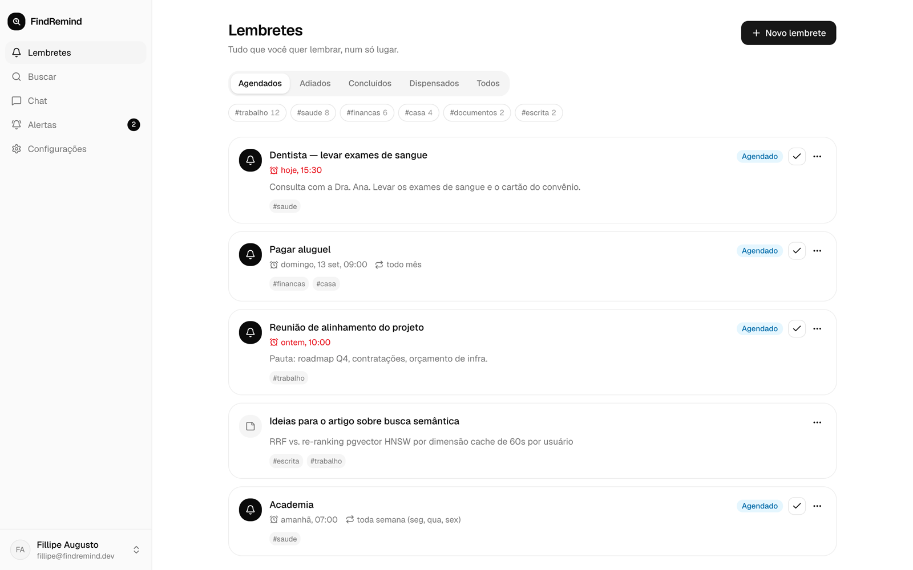
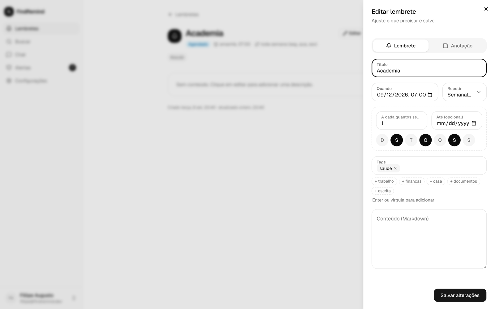
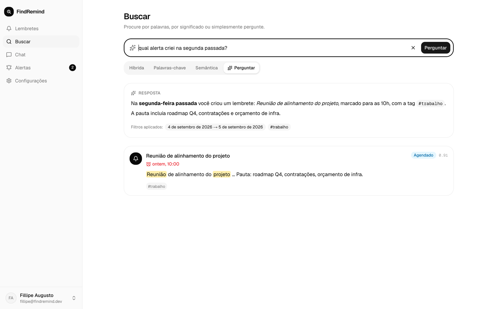
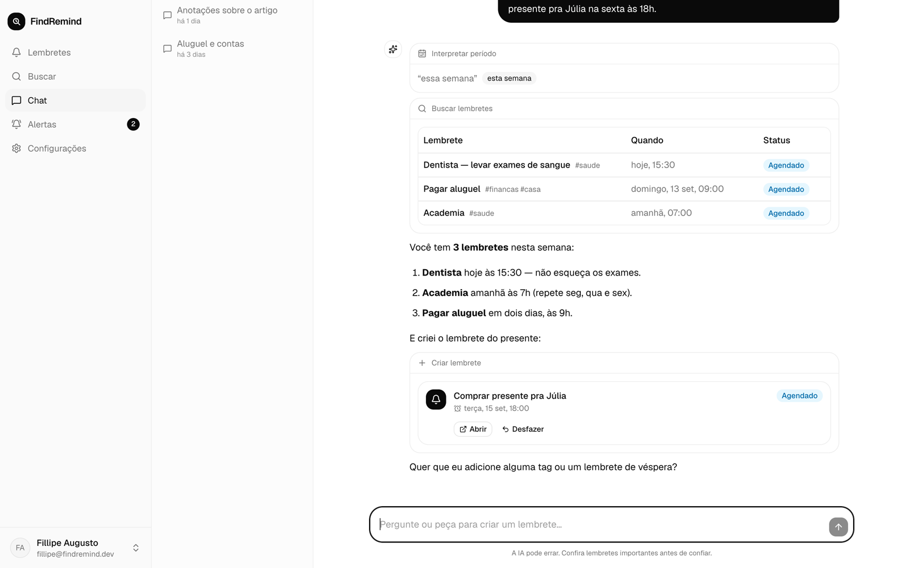
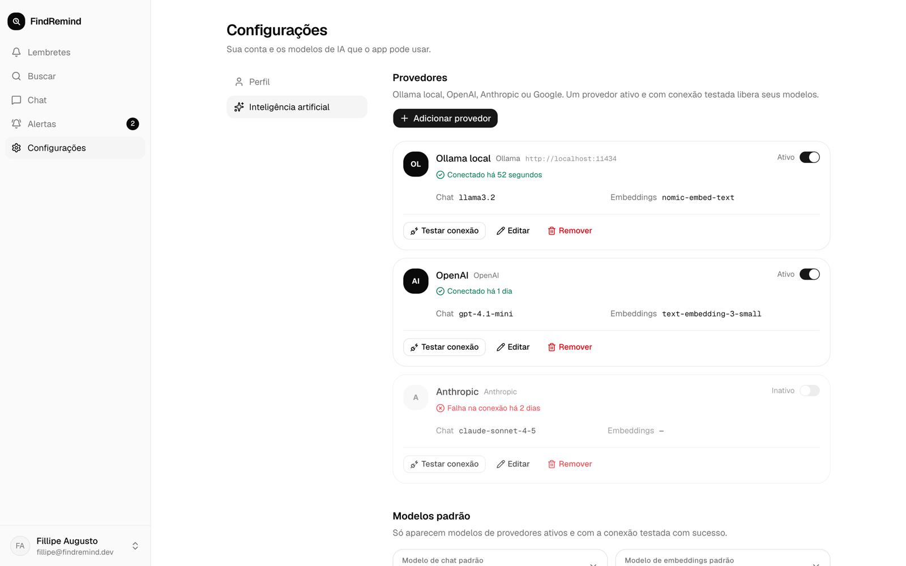
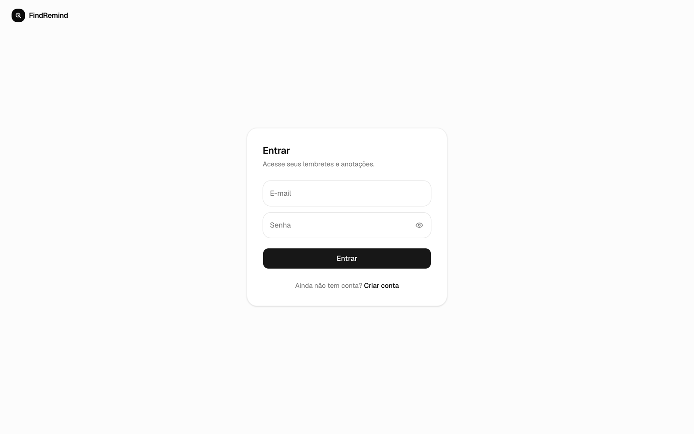

# FindRemind

Um buscador de lembretes com IA.

Eu crio lembretes e anotações, recebo os alertas na hora certa e, quando preciso lembrar de algo que anotei, pergunto em linguagem natural — "qual foi o alerta que eu criei na segunda-feira da semana passada?" — e a busca semântica encontra. Também tem um chat com IA (streaming, Markdown) que consulta e cria lembretes por mim e adapta a resposta ao conteúdo: tabela, cards, botões.

Os modelos são configuráveis na tela de IA: Ollama local, OpenAI, Anthropic e Gemini. Cada provedor que eu configuro e testa com sucesso passa a aparecer para uso.

## Screenshots

| Lembretes | Editar lembrete |
|---|---|
|  |  |

| Busca em linguagem natural | Chat com IA |
|---|---|
|  |  |

| Provedores de IA | Login |
|---|---|
|  |  |

## Stack

- **Web**: Next.js 16 (App Router), Tailwind 4, shadcn (Base UI), Motion, TanStack Query, Vercel AI SDK (`useChat`)
- **API**: Fastify 5, Zod, Better Auth, Drizzle ORM
- **Dados**: Postgres 17 + pgvector, Elasticsearch 9, Redis (cache + filas com BullMQ)
- **IA**: Vercel AI SDK com providers Ollama, OpenAI, Anthropic e Google
- **Tooling**: pnpm workspaces, Vitest, Docker Compose, GitHub Actions

## Como funciona

```
                ┌──────────────┐        ┌──────────────┐
  browser ─────►│  apps/web    │──────► │  apps/api    │
                │  Next.js     │  HTTP  │  Fastify     │
                └──────────────┘  SSE   └──────┬───────┘
                                               │
              ┌──────────────┬─────────────────┼─────────────────┬──────────────┐
              ▼              ▼                 ▼                 ▼              ▼
        Postgres +      Elasticsearch        Redis            BullMQ        Providers IA
        pgvector        (full-text)     (cache/pubsub)     (alertas,     (Ollama/OpenAI/
        (verdade +                                          indexação,    Anthropic/Gemini)
         vetores)                                           embeddings)
```

- Postgres é a fonte da verdade. Elasticsearch e os embeddings (pgvector) são derivados e atualizados por jobs.
- A busca é híbrida: BM25 no Elasticsearch + similaridade de cosseno no pgvector, fundidos com Reciprocal Rank Fusion.
- Alertas são disparados por um scheduler (BullMQ) e chegam ao navegador por SSE.
- As chaves de API dos provedores ficam criptografadas (AES-256-GCM) no banco.

## Telas

- **Lembretes** — lista com filtros por status e tag, criação/edição num painel lateral (lembrete com data, recorrência e tags, ou anotação livre em Markdown), ações de concluir, adiar e dispensar.
- **Buscar** — três modos (híbrida, palavras-chave, semântica) com highlights, mais o modo *Perguntar*, em que escrevo em linguagem natural e a IA extrai o período, as tags e responde citando os lembretes.
- **Chat** — conversas persistidas com streaming; as ferramentas que o modelo usa viram UI (tabela de lembretes, card do lembrete criado com *abrir/desfazer*, chips de tags, período interpretado).
- **Alertas** — o que já disparou, com contagem de não lidos na navegação e notificação em tempo real via SSE.
- **Configurações** — perfil e fuso horário; provedores de IA (Ollama, OpenAI, Anthropic, Google) com teste de conexão e escolha dos modelos padrão de chat e embeddings.

## Rodando localmente

Pré-requisitos: Node 24, pnpm 11, Docker.

```bash
git clone https://github.com/Fillipeaugusto/find-remind.git
cd find-remind
pnpm install

cp .env.example .env
# gere os segredos:
#   openssl rand -base64 32   -> BETTER_AUTH_SECRET
#   openssl rand -base64 32   -> AI_KEYS_ENCRYPTION_KEY

pnpm docker:up        # postgres, elasticsearch, redis
pnpm db:migrate
pnpm dev              # web em http://localhost:3000, api em http://localhost:3001
```

Documentação da API (Swagger): http://localhost:3001/docs

### Ollama (opcional)

Para usar modelos locais sem chave de API:

```bash
docker compose --profile ollama up -d
docker exec -it findremind-ollama ollama pull llama3.2
docker exec -it findremind-ollama ollama pull nomic-embed-text
```

Depois cadastre o provedor Ollama na tela de configurações de IA apontando para `http://localhost:11434`.

### Tudo em containers

```bash
docker compose --profile app up --build
```

## Desenvolvimento

```bash
pnpm test                                   # todos os testes
pnpm --filter @findremind/api test          # só a API
pnpm --filter @findremind/api test:watch
pnpm lint
pnpm typecheck
pnpm db:generate --name minha_migration  # gera migration a partir do schema Drizzle
```

Estrutura:

```
apps/
  api/        Fastify (rotas, services, jobs)
  web/        Next.js (páginas em src/app, componentes em src/components)
packages/
  db/         schema Drizzle + migrations
docs/
  api-contract.md
  tasks/
```

O CI (GitHub Actions) roda lint, typecheck, testes (com Postgres, Redis e Elasticsearch de verdade) e o build das imagens Docker. Commits seguem [Conventional Commits](https://www.conventionalcommits.org/).

## Licença

MIT
